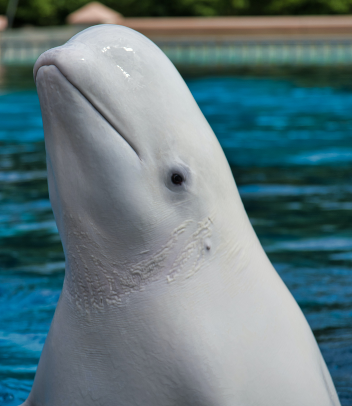
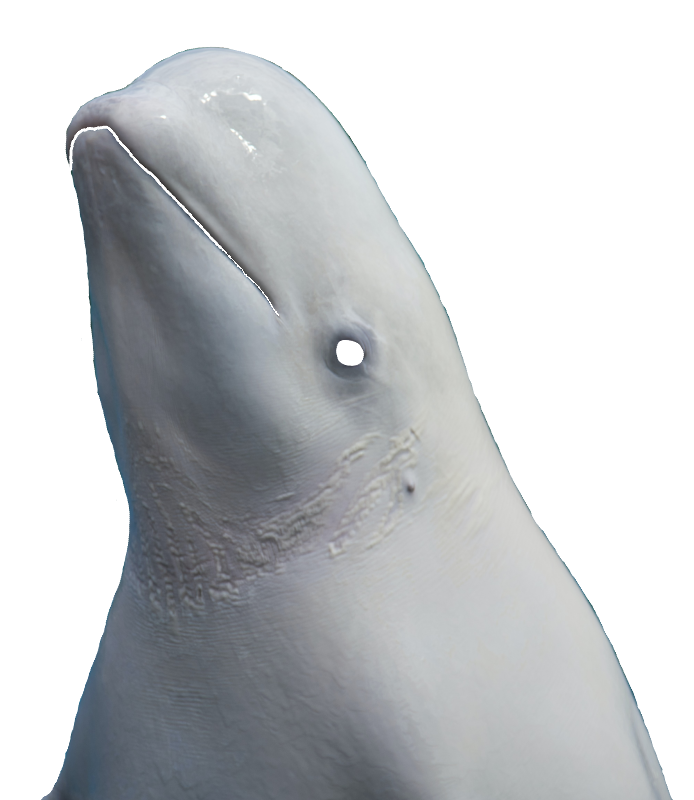

# Beluga_CanTouch
シロイルカ（ベルーガ）を触っているように見えるようにしてみました。実行する際はローカルホストで行ってください。 
 
作り方 
1. 
GIMPを使って、画像の幅（または高さ）の長い方を800pxまで縮小します。 
大きすぎる画像だと後に記述するアニメーションがカクカクしてしまうため、データのサイズを減らします。 
 
2. 
GIMPを使って、触りたい部分以外の背景を透過します。 
触りたい部分が複数ある場合は、それぞれをトリミングして背景を透過します。 
周囲に余白ができるよう50pxほど大きめにトリミングすると良いでしょう。 
余白を作る理由は、後述の関数で触っていない場合に関数を画像を歪ませる処理をしないためです。 
このリポジトリの例で触りたいのはベルーガ一匹なので、トリミングはしていません。 
 
3. 
GIMPを使って、触れる部分のパス（ファイルやURLの意味のパスではなく、画像の輪郭などイラストで使われる意味のパス）を 
取得してエクスポートします。 
 
4. 
index.phpの編集をします。 

 
   
         
  <canvas id ="CanTouchBeluga" width="694" height="800"></canvas> 
   

 
の画像のパス（ファイルのパスの意味です）を入力し、canvasのwidthとheightを指定します。 
widthとheightはMacならプレビュー.appから取得すると良いでしょう。 
 
読み込むJavaScriptは全部で5つです。 
 
 
 
 
コードを編集した時にすぐにブラウザで反映されるよう、クエリ（?<?php ~ ?>）を用いています。
（このクエリを利用するためにphpを使用しました。）
glfx.jsは画像を歪ませる処理をしてくれるライブラリです。
jqueryは歪ませた画像を表示した後、最後に表示した画像以外の過去の歪ませた画像を削除するときに便利なため
使うことにしました。
createJSは画像の当たり判定を処理しています。エクスポートしたパスはこの当たり判定のために作りました。
main.jsは画像を歪ませる処理とカーソルと画像の当たり判定を処理するJavaScriptです。

5.
CSSはこのベルーガの例では 
.CanTouchBelugaImageClass { 
  position: absolute; 
  left: 0px; 
  top: 0px; 
  z-index: 1; 
} 
となっています。
このCanTouchBelugaImageClassは歪ませた画像に付随しているクラスとなっています。
これはmain.jsのsetCanvas_and_ReproTouchCanTouchBeluga（）関数でクラスを付加しています。 
z-index: 1; 
は背景よりも前、当たり判定よりも後ろに表示するための処理です。 
left: 0px; 
top: 0px; 
は触りたい画像で触りたい画像の位置を調整してください。 
画像の大きさはGIMPであらかじめ処理しているためさらに処理を加える必要はないはずです。 

6.
main.jsの27行目、28行目のx座標、y座標は触りたい画像の位置です。 
このベルーガの例では共に0としていますが、 
5.の 
left: 0px; 
top: 0px; 
と同じ値にすることで画像の位置を調整することができます。 
 
33行目で 
CanTouchBelugaShape.alpha = 0.01; 
としているのは、完全な透明だと当たり判定の処理をしなくなってしまうためです。 
 
38行目〜79行目でGIMPでエクスポートしたパス(3.)を入力しています。 
このパスが当たり判定の範囲となります。 
 
84行目でフレームレートを指定しています。 
カクカクしないようご自身で調整してください。 
 
参考リンク： https://ics.media/tutorial-createjs/ticker/
 
7. 
main.jsのsetCanvas_and_ReproTouchCanTouchBeluga()関数の 
130行目で歪ませた後の画像を表示する座標を指定します。 
ここでは共に0としていますが、表示させたい画像の場所を調整することができます。 
70は歪ませる範囲の半径、0.28はどのぐらい強く歪ませるかの値です。 
 
参考リンク： https://evanw.github.io/glfx.js/docs/
 
これで終了です。 
 

